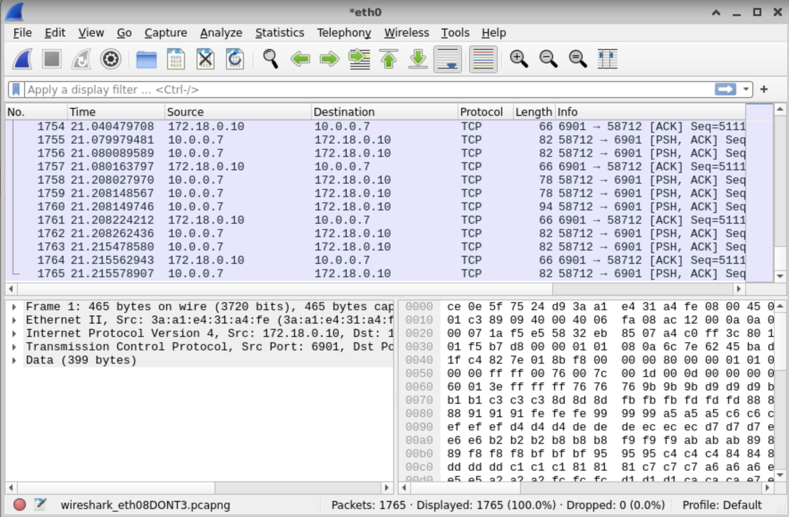
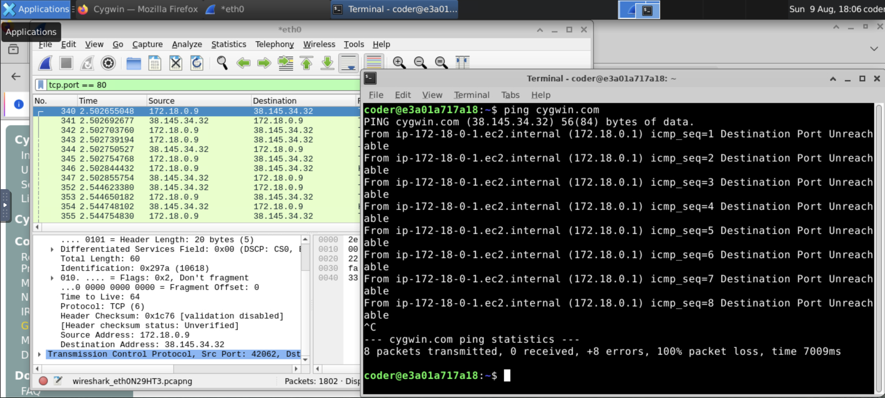

# Wireshark-TCP-IP-Protocol-Fundamentals
- I will use wireshark to capture and save packets on a physical wired network, also create a filter to observe TCP/IP Packet, and
  observe HTTP &amp; HTTPS  TCP/IP Protocol and Finally Identify the TCP/IP Protocol Stack.

---

## Table of Contents

- [Architecture Overview](#architecture-overview)
- [Project Goal](#project-goal)
- [Project1 Goal](#project-goal1)

---

## Project Goal

- The IT Manager wants to be able to monitor web traffic on the server in order to verify website visited are exhibiting proper
  TCP/IP behavior.

---

## Scenario

- The company I'm working for wants to observe packet information in order to understand potential TCP/IP network issues.

---

## Tasks

### Task 1 ( Start a packet capture on the wired Ethernet port and save it to file )

#### Wireshark Interface Task 1

#### Task 2 ( Use a display filter to observe the internet Layer of TCP/IP network traffic )

- In this task, I visited web page http://cygwin.com and observe the IP address in the internet Layer.

#### Wireshark Interface Task 2

## Takeaway
- The main takeaway was to display http packets with the display filter tcp.port == 80.
- To ping a websites to obtain an IP address or to check if the website is active.
- To display a particular IP address with the display filter ip.addr == 172.xx.x.x
- To find the source IP and destination IP for the communication.

